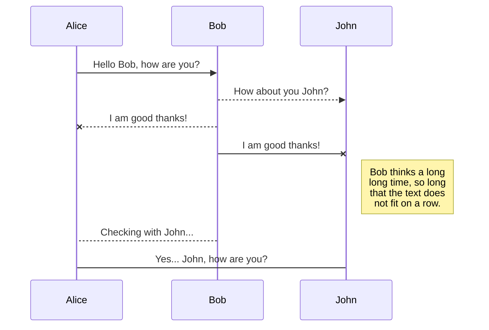

#歡迎來到 TIC101-03！

你好！我是您在** StackEdit **中的第一個 Markdown 檔案。如果你想了解StackEdit，可以看我。如果你想玩Markdown，你可以編輯我。完成後，您可以透過開啟導覽列左上角的**檔案總管**來建立新檔案。

#文件

StackEdit 將您的檔案儲存在瀏覽器中，這表示您的所有檔案都會自動儲存在本機，並且可以**離線存取！**

##建立檔案和資料夾

可使用導覽列左角的按鈕存取檔案總管。您可以透過點擊檔案總管中的**新檔案**按鈕來建立新檔案。您也可以透過點擊「**新資料夾**」按鈕來建立資料夾。

##切換到另一個文件

您的所有檔案和資料夾都在檔案總管中顯示為樹。您可以透過點擊樹中的檔案從一個檔案切換到另一個檔案。

##重新命名文件

您可以透過點擊導覽列中的檔案名稱或按一下檔案總管中的「**重新命名**」按鈕來重新命名目前檔案。

##刪除一個文件

您可以透過點擊檔案總管中的「**刪除**」按鈕來刪除目前檔案。該檔案將移至**垃圾箱**資料夾，並在 7 天不活動後自動刪除。

##匯出文件

您可以透過點擊選單中的「匯出到磁碟」來匯出目前檔案。您可以選擇將文件匯出為純 Markdown、使用 Handlebars 模板的 HTML 或 PDF。

#同步

同步是StackEdit最大的特點之一。它使您能夠將工作區中的任何文件與儲存在** Google Drive **、** Dropbox **和** GitHub **帳戶中的其他文件同步。這使您可以繼續在其他設備上編寫，與共享文件的人協作，輕鬆整合到您的工作流程中......同步機制每分鐘在後台發生，下載、合併和上傳文件修改。

有兩種類型的同步，它們可以相互補充：

-工作區同步將自動同步您的所有檔案、資料夾和設定。這將允許您在任何其他設備上獲取工作區。	>要開始同步您的工作區，只需在選單中使用 Google 登入即可。 -檔案同步將使工作區的一個檔案與** Google Drive **、** Dropbox **或** GitHub **中的一個或多個檔案同步。	>在開始同步文件之前，您必須在**同步**子選單中連結帳戶。

##開啟文件

您可以透過開啟**同步**子選單並點擊**從**打開，從** Google Drive **、** Dropbox **或** GitHub **開啟檔案。在工作區中開啟後，文件中的任何修改都會自動同步。

##儲存文件

You can save any file of the workspace to **Google Drive**, **Dropbox** or **GitHub** by opening the **Synchronize** sub-menu and clicking **Save on**. Even if a file in the workspace is already synced, you can save it to another location. StackEdit can sync one file with multiple locations and accounts.

## Synchronize a file

Once your file is linked to a synchronized location, StackEdit will periodically synchronize it by downloading/uploading any modification. A merge will be performed if necessary and conflicts will be resolved.

If you just have modified your file and you want to force syncing, click the **Synchronize now** button in the navigation bar.

> **Note:** The **Synchronize now** button is disabled if you have no file to synchronize.

## Manage file synchronization

Since one file can be synced with multiple locations, you can list and manage synchronized locations by clicking **File synchronization** in the **Synchronize** sub-menu. This allows you to list and remove synchronized locations that are linked to your file.

# Publication

Publishing in StackEdit makes it simple for you to publish online your files. Once you're happy with a file, you can publish it to different hosting platforms like **Blogger**, **Dropbox**, **Gist**, **GitHub**, **Google Drive**, **WordPress** and **Zendesk**. With [Handlebars templates](http://handlebarsjs.com/), you have full control over what you export.

> Before starting to publish, you must link an account in the **Publish** sub-menu.

## Publish a File

You can publish your file by opening the **Publish** sub-menu and by clicking **Publish to**. For some locations, you can choose between the following formats:

- Markdown: publish the Markdown text on a website that can interpret it (**GitHub** for instance),
- HTML: publish the file converted to HTML via a Handlebars template (on a blog for example).

## Update a publication

After publishing, StackEdit keeps your file linked to that publication which makes it easy for you to re-publish it. Once you have modified your file and you want to update your publication, click on the **Publish now** button in the navigation bar.

> **Note:** The **Publish now** button is disabled if your file has not been published yet.

## Manage file publication

Since one file can be published to multiple locations, you can list and manage publish locations by clicking **File publication** in the **Publish** sub-menu. This allows you to list and remove publication locations that are linked to your file.

# Markdown extensions

StackEdit extends the standard Markdown syntax by adding extra **Markdown extensions**, providing you with some nice features.

> **ProTip:** You can disable any **Markdown extension** in the **File properties** dialog.

## SmartyPants

SmartyPants converts ASCII punctuation characters into "smart" typographic punctuation HTML entities. For example:

|                |ASCII                          |HTML                         |
|----------------|-------------------------------|-----------------------------|
|Single backticks|`'Isn't this fun?'`            |'Isn't this fun?'            |
|Quotes          |`"Isn't this fun?"`            |"Isn't this fun?"            |
|Dashes          |`-- is en-dash, --- is em-dash`|-- is en-dash, --- is em-dash|

## KaTeX

You can render LaTeX mathematical expressions using [KaTeX](https://khan.github.io/KaTeX/):

The *Gamma function* satisfying $\Gamma(n) = (n-1)!\quad\forall n\in\mathbb N$ is via the Euler integral

$$
\Gamma(z) = \int_0^\infty t^{z-1}e^{-t}dt\,.
$$

> You can find more information about **LaTeX** mathematical expressions [here](http://meta.math.stackexchange.com/questions/5020/mathjax-basic-tutorial-and-quick-reference).

## UML diagrams

You can render UML diagrams using [Mermaid](https://mermaidjs.github.io/). For example, this will produce a sequence diagram:

And this will produce a flow chart:

``美人魚
圖 LR 
A[方形矩形] -- 連結文字 --> B((圓形)) 
A --> C(圓形矩形) 
B --> D{菱形} 
C --> D `` `

